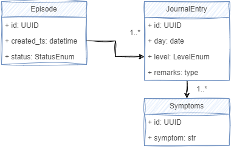
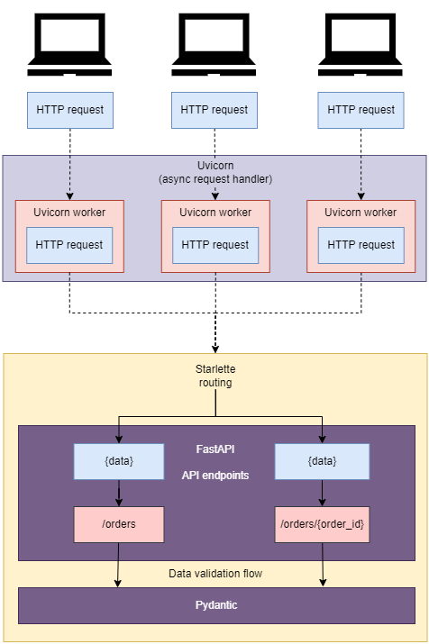
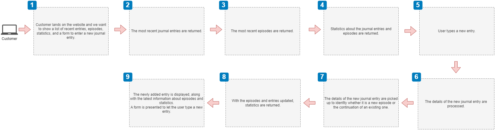
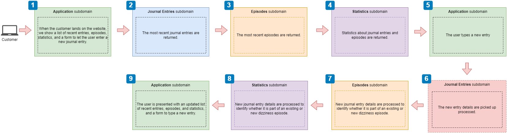

# The web apps
> design and other info about the web apps to build

## Intro

To illustrate concepts about microservice architectures, API design and FastAPI implementation, I will be building a couple of web apps with different level of complexity.

+ **simple** &mdash; A *'Dizziness Tracker'* application that allows a user to create a journal of their dizziness episodes (duration, when did it start, how strong it was, etc.) and get some statistics about the recorded data (how many episodes were recorded in the past x months, etc.).

+ **complex** &mdash; A *'MovieDB'* application that allows a user to record the movies and tv shows they've watched and get some statistics about them. This example opens up interesting capabilities such as scraping of information from movie sites to populate the information about the cast, exporting information to spreadsheets for review, etc.

Along the way, certain webapp design and FastAPI concepts will be introduced in the context of the applications being developed.


## Step 1: Discovery phase: Description of the functionality

The process begins with a discovery phase that describes, in broad strokes, the software application we want to build. Because it is a discovery stage, functionality and technical topics might be mixed together: there are no rules!

You should expect this description to be updated as the software project evolves and new aspects are unveiled in the subsequent phases.

### Dizziness Tracker

The Dizziness Tracker application allows a user to record in a journal their dizziness episodes.

Typically, a user will create a journal entry specifying the date, the level of dizziness they feel, and any remarks associated to that entry. When a user feels dizziness, it typically spans several days. An episode will therefore include several journal entries.

After having recorded journal entries, the user would like to gather certain statistics about their dizziness episodes, and search by different criteria (by date range, by the degree, count the episodes, or understand the average duration of their episodes).

#### Data Model

In the data model, the fundamental entity is the `JournalEntry` which describes a record in the Dizziness Tracker.

The data is very simple:
+ date of the journey
+ level of dizziness the user feels
+ any relevant remarks

The level of dizziness is a value in the range 0-5 that has certain associated symptoms. For example, level 0 is 'not feeling dizzy at all', level 1 is 'feeling a little light-headed but completely functional'.

A few other relevant entities are:
+ LevelSymptoms: a set of symptoms associated to a given level.
+ Episode: a list of associated journal entries that identifies records that go together.

In particular, the episode is a calculated entity that is composed of a sequence of back-to-back journal entries, typically encompassing several days.



## Step 2: Prototyping: initial scaffolding

It's too early to do a thorough API specification at this stage, as we only have a short description of the application and a few high-level notes about the data model.

However, creating a small prototype of a portion of the application will give us some early hands-on experience, and will allow us unveil challenges we will have to solve on the subsequent phases.

We can start by creating a simple application exposing a REST interface for some portion of the application, with some payload validation, and a fake data layer that we could directly use from the web layer.

### A few words about FastAPI

To build the prototype described above, that returns *canned* responses, and that will be used as the stepping stone that will let us implement additional capabilities we will use FastAPI.

[FastAPI](https://github.com/tiangolo/fastapi) is a web application framework built on top of [Starlette](https://github.com/encode/starlette) &mdash; a high-performance, lightweight, async server gateway interface (ASGI).

In addition, FastAPI relies on [pydantic](https://github.com/samuelcolvin/pydantic/) for data validation.



| NOTE: |
| :---- |
| As opposed to the Web Server Gateway Interface (WSGI), which is a Python standard specification to connect application code to servers in an sync fashion, ASGI does that asynchronously to foster concurrency. |

### Dizziness Tracker

We create the prototype [Dizziness Tracker](./dizziness-tracker/03_dizziness-tracker_fakes-web/README.md) with a web data layer, payload validation, and a fake data layer that allow a sort of poor-man's in-memory database.

We define the boundaries around the journal entries (which is the main entity of the application), and the related symptoms.


#### API specification

For this initial prototype, as we only we want to get some hands-on experience with FastAPI, Pydantic, and the most relevant entities, we expose only the interface to maintain the journal entries. The associated symptoms will be managed internally (as if they were preloaded), and there will be no management of episodes.

As a result, we will define an  `/entries` resource with the following capabilities:

+ `/entries`
  + `GET` &mdash; retrieves the full list of journal entries.
  + `POST` &mdash; creates a new journal entry.

+ `/entries/{entry_id}`
  + `GET` &mdash; returns an entry
  + `PUT` &mdash; replaces an entry
  + `PATCH` &mdash; modifies an entry
  + `DELETE` &mdash; deletes an entry

| NOTE: |
| :---- |
| We will not have at this point any modeled action, such as `/episodes/{episode_id}/close`. |

##### A few words about creating the API spec in FastAPI

Doing an API-first design is strongly encouraged, and the standard way to do so is through an OpenAPI spec document in either YAML or JSON.

Traditionally, you would write the OpenAPI spec document, and then implement your services to fulfill such spec (maybe with the help of some code generation tools).

FastAPI follows the inverse approach: it lets you define your API interface using Python, and then generates the OpenAPI spec for you. This ensures that your OpenAPI documentation always reflects the code.

You can test your app using the generated OpenAPI spec visiting http:<your-app-url>/docs.

#### Concepts realized in the scaffolding

In the final scaffolding found in [Dizziness Tracker](./dizziness-tracker/03_dizziness-tracker_fakes-web/README.md) we validate the following topics:

+ REST API for the `/entries` resource, with the correct response status codes.

+ Input payload validation and output response validation using Pydantic models.

+ Fake data layer, used from the web layer, that allows the user to maintain entries.

+ Management of duplicated journal entries (by date), and not found entries (by id).

+ Management of custom validators to prevent sending JSON nulls, as `remarks: null`.

## Step 3: Applying strategic design

In this step, you go further in the analysis of the application, trying to unveil the core domain and subdomains of the application.

The goal is to end up with one or more microservices that fulfill the application's functionalities, and each of the microservices following the fundamentals design principles:

1. **Database per service principle**

    Each microservice must own a specific set of data, and no other service should have access to such data except through an API.

1. **Loose coupling principle**

    Each microservice must be able to work independently from others. If a service can't fulfill a single request without calling another service, they belong together.

    Additionally, each microservice must be able to be updated without impacting other services. If changes to a service require updates to other services there is a tight coupling that must be removed by applying more design work.

1. **Single responsibility principle**

    A microservice should be designed around a single business capability or subdomain.

The **strategic analysis** process we will follow can be summarized as folows:

1. Describe in text an operation the user needs to perform, as a sequence of steps (e.g., successful delivery of a customer's order).

1. Create a user-journey diagram, depicting in broad lines what happens in each of the operation steps (e.g., [user journey](../02_microservice-concepts/pics/user_journey_mama_janes.png))

1. Create a subdomain discovery diagram that identifies the subdomains that play a role in each step.

1. For each subdomain, do a textual elaboration of the following aspects:
  + What is the subdomain's main responsibility.
  + What is the data the subdomain owns.
  + What inbound and outbound interactions are expected in the subdomain (i.e., the interface).

1. Map each subdomain to a microservice and confirm the identified microservices fulfill the three microservices principles.

Let's do so for our applications

### Dizziness Tracker: Applying strategic design

In this section we will follow the strategic design process to the Dizziness Tracker. Note that because the app is simple, many of the steps will be trivial.

#### Step 3.1: Describing the operation

We will model the process of a user recording journal entries of their dizziness episodes in the application, and receiving information about it.

The process can be broken down into the following steps:

1. When the user hits the application URL, they are presented with a form allowing the user to enter a new entry, and a table displaying most recent entries and episodes. For each entry, the different symptoms are also displayed. Some statistics are also displayed.

1. The user enters a new journal entry.

1. Once the entry has been added, the new entry details are passed on, so that episodes can be kept up to date.

1. The episodes portion picks up the details of the new entry and updates the status: is it a new episode, is the continuation of an existing one?

1. Once the episodes portion is completed, the user is presented with an updated view of the journal entries and some statistics.

#### Step 3.2: The user-journey diagram

The steps from the previous section can be roughly pictured in a user journey.



Because of the simplicity of the application, the user journey is nothing fancy. It just shows the different steps involved in the operation.

#### Step 3.3: The subdomain discovery diagram

The user-journey leads us to the discovery of the application subdomains that pay a role in each step:



#### Step 3.4: Elaborating on the subdomains

In this step, we elaborate on the following aspects:
+ What is the subdomain main responsibility.
+ What is the data the subdomain owns.
+ What inbound and outbound interactions will be expected in this subdomain

This will let us map each subdomain to a microservice:

+ **Application** &mdash; It will coordinate the display of the dizziness related information (entries, episodes, statistics) and manage the UI interaction. It will not own any data. It will interact with the other subdomains to retrieve the required information to be displayed to the user.

+ **Journal Entries** &mdash; Handles the journal entries of the 'Dizziness Tracker'. It will own the individual journal entries that describe what the user feels in a particular day. It will expose an interface to perform CRUD operations on those entries.

+ **Episodes** &mdash; Manages the dizziness episodes, which groups one or more consecutive journal entries. It will own the episode related data. It will expose an interface to be able to read the episode information, but will not expose any create/update/delete as this information is calculated. It also exposes an operation to process a newly requested journal entry, to be able to pick up its detail and update the episodes data.

+ **Statistics** &mdash; Manages statistics of journal entries and episodes. It will own the statistics related data (if stored). It will expose an interface to to expose the different statistic that are generated, and will interact with the 'Journal Entries' and 'Episodes' subdomains to read their current and be able to calculate the statistics.

#### Step 3.5: Identifying the microservices

In this step we simply do a 1:1 mapping between the identified subdomains and the microservices/services we will build. Because this is a small app, we could opt for joining together a few subdomains in a single project using different routers.

However, for illustration purposes, we will create a microservice per subdomain, even if that design leads us to very small microservices.

The microservices, along with certain technical details, associated with them will be:

+ **Application** &mdash; A Streamlit application that will manage user interaction and coordinate the invocation of the other services. It will show a form, a table with the journal entries, and some statistics.

+ **Journal Entries** &mdash; A FastAPI microservice to manage journal entries and symptoms. It will expose a full CRUD API and own all the journal entries and symptoms data.

+ **Episodes** &mdash; A FastAPI microservice to manage episodes, which is a computed domain model concept not managed by the user. It will expose a read REST API to retrieve episodes and an operation to receive the notification that a new journal entry has been created.

+ **Statistics** &mdash; a FastAPI microservice to manage statistics about journal entries and episodes. It will expose a read REST API to get the latest statistics. Depending on the performance, it might need to own a piece of data with certain precomputed values.

## Step 4: Writing the OpenAPI spec

While FastAPI doesn't require you to manually write the OpenAPI spec, spending some time crafting the spec is a good exercise to get some introspection about the APIs you're creating.

Thus, I will be following the steps described in [API: Concepts &raquo; Summary: manually writing OpenAPI spec](../01_api-concepts/README.md#summary-manually-writing-openapi-spec-to-document-your-rest-apis)


### Dizziness Tracker: Writing the OpenAPI spec

I will be writing the Journal Entries REST API and saving it in [oas.yaml](dizziness-tracker/04_dizziness-tracker_openapi-spec/oas.yaml).

| NOTE: |
| :---- |
| As the OpenAPI spec was manually crafted, it might contain typos and incorrections. The idea of writing the spec is gain some understanding of the OpenAPI spec and the service API and its schemas. |

#### Step 4.1: Get your API designed

In the first step, you have to make sure you have your API designed according to the [REST API Design Principles](../01_api-concepts/README.md#rest-apis-design-principles).

In particular we should make sure:
  + we're using HTTP *the correct* way.
  + we signal the result of the API call with the correct HTTP status code in case of success or error.
  + Input API payloads are well designed.
  + Error response payloads include an `"error"`, or `"detail"` key explaining why the client is getting an error.
  + Response payloads are well designed.
  + URL query parameters are used to filter collections.
  + Pagination is used (if required).

| NOTE: |
| :---- |
| All these aspects will be reflected in the OpenAPI spec. |

#### Step 4.2: Create a YAML file with the OpenAPI required sections

The first thing is creating an empty YAML file with the required `openapi`, `info`, `servers`, `paths`, and `components`.

```yaml
openapi:

info:

servers:

paths:

components:

```

#### Step 4.3: Populate the `openapi`, `info`, and `servers` sections

In this step we add basic informational metadata about our API. Note that as we're not yet deploying anywhere, the `servers` section only describes how we can test in localhost:

```yaml
openapi: 3.1.0

info:
  title: Journal Entries API for the Dizziness Tracker
  description: >
    API that allows you to manage the Journal Entries
    of the Dizziness Tracker app
  version: 0.1.0

servers:
  - url: http://localhost:5000
    description: local development server

paths:

components:

```

#### Step 4.4: Initial population of the `paths` section

In this step, we first create a table summarizing the API endpoints, which we'll use for start writing the `paths` section.

Let's start with the table:

| Endpoint | Responsibility |
| :------- | :------------- |
| `GET /entries` | Retrieve a list of journal entries. |
| `POST /entries` | Create a journal entry. |
| `GET /entries/{entry_id}` | Return a journal entry. |
| `PUT /entries/{entry_id}` | Replace a journal entry. |
| `PATCH /entries/{entry_id}` | Update a journal entry. |
| `DELETE /entries/{entry_id}` | Delete a journal entry. |

| NOTE: |
| :---- |
| Rows in the able are typically sorted by resource, as the OpenAPI spec follows the same sorting strategy. |

Now we can start *transporting* the table information into the corresponding `paths` section. We will be adding only the `summary` and `operationId` for each endpoint.

```yaml
openapi: 3.1.0

info:
  title: Journal Entries API for the Dizziness Tracker
  description: >
    API that allows you to manage the Journal Entries
    of the Dizziness Tracker app
  version: 0.1.0

servers:
  - url: http://localhost:5000
    description: local development server

paths:
  /entries:
    get:
      summary: Retrieve a list of journal entries.
      operationId: getEntries
    post:
      summary: Create a journal entry.
      operationId: createEntry

  /entries/{entry_id}:
    get:
      summary: Return a journal entry.
      operationId: getEntry
    put:
      summary: Replace a journal entry.
      operationId: replaceEntry
    patch:
      summary: Update a journal entry.
      operationId: updateEntry
    delete:
      summary: Delete a journal entry.
      operationId: deleteEntry

components:

```

#### Step 4.5: Document your URL query parameters

In this step, we should enrich the `paths` section with all the query parameters our application supports.

In our current version, we didn't define any such query parameter, but in the vision, we have foreseen that we would want to filter the results &mdash; URL query parameters will be really helpful there.

Let's assume that we want to filter the journal entries:
+ limiting the number of journal entries that we return. The UI will probably only list the latest 10-15 entries, so it will be helpful to include a `limit` URL query parameter in our API.

+ returning only the journal entries of the current episode. This will be helpful to manage the most recent set of journal entries, and help the user track the dizziness episode at it is happening. A `open` URL query allowing a boolean value will let the system know that it should return only the journal entries that are associated to an open episode.

Thus, let's include those in our OpenAPI spec file:

```yaml
openapi: 3.1.0

info:
  title: Journal Entries API for the Dizziness Tracker
  description: >
    API that allows you to manage the Journal Entries
    of the Dizziness Tracker app
  version: 0.1.0

servers:
  - url: http://localhost:5000
    description: local development server

paths:
  /entries:
    get:
      summary: Retrieve a list of journal entries.
      description: >
        Returns the list of journal entries sorted by date in descending order
        (most recent first). It allows retrieving only a given number of
        entries, and getting only the ones associated to an open episode.
      operationId: getEntries
      parameters:
        - name: limit
          in: query
          required: false
          schema:
            type: integer
        - name: open
          in: query
          required: false
          schema:
            type: boolean
    post:
      summary: Create a journal entry.
      operationId: createEntry

  /entries/{entry_id}:
    get:
      summary: Return a journal entry.
      operationId: getEntry
    put:
      summary: Replace a journal entry.
      operationId: replaceEntry
    patch:
      summary: Update a journal entry.
      operationId: updateEntry
    delete:
      summary: Delete a journal entry.
      operationId: deleteEntry

components:

```

Note that we have added a `description` that goes along with the summary, to describe the capabilities of the endpoint.

#### Step 4.6: Document your URL path parameters

Now, we update our `path` section by adding information about the path parameters. In our case, we only have the `entra_id` parameter, which we will have to include accordingly.

```yaml
openapi: 3.1.0

info:
  title: Journal Entries API for the Dizziness Tracker
  description: >
    API that allows you to manage the Journal Entries
    of the Dizziness Tracker app
  version: 0.1.0

servers:
  - url: http://localhost:5000
    description: local development server

paths:
  /entries:
    get:
      summary: Retrieve a list of journal entries.
      description: >
        Returns the list of journal entries sorted by date in descending order
        (most recent first). It allows retrieving only a given number of
        entries, and getting only the ones associated to an open episode.
      operationId: getEntries
      parameters:
        - name: limit
          in: query
          required: false
          schema:
            type: integer
        - name: open
          in: query
          required: false
          schema:
            type: boolean
    post:
      summary: Create a journal entry.
      operationId: createEntry

  /entries/{entry_id}:
    parameters:
      - in: path
        name: entry_id
        required: true
        schema:
          type: string
          format: uuid
    get:
      summary: Return a journal entry.
      operationId: getEntry
    put:
      summary: Replace a journal entry.
      operationId: replaceEntry
    patch:
      summary: Update a journal entry.
      operationId: updateEntry
    delete:
      summary: Delete a journal entry.
      operationId: deleteEntry

components:

```

#### Step 4.7: Document your input payloads

In this section we will add content to the `components` section of the OpenAPI spec document. We will start by describing the different input payloads, and using them as input for the corresponding sections.

Let's start with the `POST /entries` section. An example payload and the corressponding accompanying element description will look like:

```json
{
  "day":"2024-09-07",
  "level":"level_0_not_dizzy",
  "remarks":"feeling OK"
}
```

| Payload property | Description |
| :--------------- | :---------- |
| `day` | The day the journal entry refers to in the format "YYYY-MM-DD". |
| `level` | The degree of dizziness the user feels. It has to be one of: `level_0_not_dizzy`, `level_1_slightly_dizzy`, `level_2_dizzy`, `level_3_quite_dizzy`, `level_4_very_dizzy`, `level_5_super_dizzy`. |
| `remarks` | Free text in which the user annotates the journal entry. It is optional, but if present, it must not be null. If not provided, "" (empty string) will be assumed. |

Note that even for this very simple case the table provides a very detailed description of the payload properties.

With this information in place, we can create the corresponding information in the `components` section.

```yaml
openapi: 3.1.0

info:
  title: Journal Entries API for the Dizziness Tracker
  description: >
    API that allows you to manage the Journal Entries
    of the Dizziness Tracker app
  version: 0.1.0

servers:
  - url: http://localhost:5000
    description: local development server

paths:
  /entries:
    get:
      summary: Retrieve a list of journal entries.
      description: >
        Returns the list of journal entries sorted by date in descending order
        (most recent first). It allows retrieving only a given number of
        entries, and getting only the ones associated to an open episode.
      operationId: getEntries
      parameters:
        - name: limit
          in: query
          required: false
          schema:
            type: integer
        - name: open
          in: query
          required: false
          schema:
            type: boolean
    post:
      summary: Create a journal entry.
      operationId: createEntry

  /entries/{entry_id}:
    parameters:
      - in: path
        name: entry_id
        required: true
        schema:
          type: string
          format: uuid
    get:
      summary: Return a journal entry.
      operationId: getEntry
    put:
      summary: Replace a journal entry.
      operationId: replaceEntry
    patch:
      summary: Update a journal entry.
      operationId: updateEntry
    delete:
      summary: Delete a journal entry.
      operationId: deleteEntry

components:
  schemas:
    CreateJournalEntrySchema:
      type: object
      properties:
        day:
          type: string
          format: date
        level:
          type: string
          enum:
            - level_0_not_dizzy
            - level_1_slightly_dizzy
            - level_2_dizzy
            - level_3_quite_dizzy
            - level_4_very_dizzy
            - level_5_super_dizzy
        remarks:
          type: string
          default: ""
      required:
        - day
        - level

```

Now we repeat the process for the remaining input payloads:

+ The `PUT /entries/{entry_id}` will reuse the same `CreateJournalEntrySchema`.

For the `PATCH /entries/{entry_id}`:

```json
{
  "day": "2024-09-11"
}
```

| Payload property | Description |
| :--------------- | :---------- |
| `day` | The day the journal entry refers to in the format "YYYY-MM-DD". Optional. |
| `level` | The degree of dizziness the user feels. It has to be one of: `level_0_not_dizzy`, `level_1_slightly_dizzy`, `level_2_dizzy`, `level_3_quite_dizzy`, `level_4_very_dizzy`, `level_5_super_dizzy`. Optional. |
| `remarks` | Free text in which the user annotates the journal entry. It is optional, but if present, it must not be null. If not provided, "" (empty string) will be assumed. |

We see that we have the same fields as in the `CreateJournalEntry`, the difference being that now all the fields are optional, as the `PATCH` operation allows for sending only certain items.

| NOTE: |
| :---- |
| In more complicated scenarios, we should rely on JSON Patch to apply such changes. In this very simple example, this payload with all the optional fields, or a simple dictionary will suffice. |

Because the fields are the same, we can reference the recently updated properties:

```yaml
openapi: 3.1.0

info:
  title: Journal Entries API for the Dizziness Tracker
  description: >
    API that allows you to manage the Journal Entries
    of the Dizziness Tracker app
  version: 0.1.0

servers:
  - url: http://localhost:5000
    description: local development server

paths:
  /entries:
    get:
      summary: Retrieve a list of journal entries.
      description: >
        Returns the list of journal entries sorted by date in descending order
        (most recent first). It allows retrieving only a given number of
        entries, and getting only the ones associated to an open episode.
      operationId: getEntries
      parameters:
        - name: limit
          in: query
          required: false
          schema:
            type: integer
        - name: open
          in: query
          required: false
          schema:
            type: boolean
    post:
      summary: Create a journal entry.
      operationId: createEntry

  /entries/{entry_id}:
    parameters:
      - in: path
        name: entry_id
        required: true
        schema:
          type: string
          format: uuid
    get:
      summary: Return a journal entry.
      operationId: getEntry
    put:
      summary: Replace a journal entry.
      operationId: replaceEntry
    patch:
      summary: Update a journal entry.
      operationId: updateEntry
    delete:
      summary: Delete a journal entry.
      operationId: deleteEntry

components:
  schemas:
    CreateJournalEntrySchema:
      type: object
      properties:
        day:
          type: string
          format: date
        level:
          type: string
          enum:
            - level_0_not_dizzy
            - level_1_slightly_dizzy
            - level_2_dizzy
            - level_3_quite_dizzy
            - level_4_very_dizzy
            - level_5_super_dizzy
        remarks:
          type: string
          default: ""
      required:
        - day
        - level

    UpdateJournalEntrySchema:
      type: object
      properties:
        $ref: "/components/schemas/CreateJournalEntry/properties"
```

With the input payloads defined, we just need to identify them in the corresponding endpoints in the `paths` section:

```yaml
openapi: 3.1.0

info:
  title: Journal Entries API for the Dizziness Tracker
  description: >
    API that allows you to manage the Journal Entries
    of the Dizziness Tracker app
  version: 0.1.0

servers:

paths:
  /entries:
    get:
      summary: Retrieve a list of journal entries.
      description: >
        Returns the list of journal entries sorted by date in descending order
        (most recent first). It allows retrieving only a given number of
        entries, and getting only the ones associated to an open episode.
      operationId: getEntries
      parameters:
        - name: limit
          in: query
          required: false
          schema:
            type: integer
        - name: open
          in: query
          required: false
          schema:
            type: boolean
    post:
      summary: Create a journal entry.
      operationId: createEntry
      requestBody:
        required: true
        content:
          application/json:
            schema:
              $ref: "#/components/schemas/CreateJournalEntrySchema"

  /entries/{entry_id}:
    parameters:
      - in: path
        name: entry_id
        required: true
        schema:
          type: string
          format: uuid
    get:
      summary: Return a journal entry.
      operationId: getEntry
    put:
      summary: Replace a journal entry.
      operationId: replaceEntry
      requestBody:
        required: true
        content:
          application/json:
            schema:
              $ref: "#/components/schemas/CreateJournalEntrySchema"
    patch:
      summary: Update a journal entry.
      operationId: updateEntry
      requestBody:
        required: true
        content:
          application/json:
            schema:
              $ref: "#/components/schemas/UpdateJournalEntrySchema"
    delete:
      summary: Delete a journal entry.
      operationId: deleteEntry

components:
  schemas:
    CreateJournalEntrySchema:
      type: object
      properties:
        day:
          type: string
          format: date
        level:
          type: string
          enum:
            - level_0_not_dizzy
            - level_1_slightly_dizzy
            - level_2_dizzy
            - level_3_quite_dizzy
            - level_4_very_dizzy
            - level_5_super_dizzy
        remarks:
          type: string
          default: ""
      required:
        - day
        - level

    UpdateJournalEntrySchema:
      type: object
      properties:
        $ref: "/components/schemas/CreateJournalEntry/properties"

```

#### Step 4.8: Documenting your response payloads

In this section we start by updating the components section writing the response schemas.

We follow the same approach we used with the input payloads, using sample response payloads that we translate into the corresponding `#/components/schemas/` snippets:

Let's start with the `GetJournalEntriesSchema`, which is the reponse payload for the `GET /entries` endpoint:

```json
{
    "entries": [
        {
            "day": "2024-07-01",
            "id": "4eb3009f-1411-46a4-b499-a6e653583ac3",
            "level": "level_0_not_dizzy",
            "remarks": "yay!",
            "symptoms": [
                {
                    "desc": "No symptoms, as before or after having an episode",
                    "id": "f73b0e80-66bb-4270-b48b-4cae304cc567"
                },
                {
                    "desc": "Fully functional",
                    "id": "c505d1cb-98d3-4fdb-9144-6bbaf1c84aca"
                }
            ]
        },
        {
            "day": "2024-07-05",
            "id": "2905d65b-8164-48d6-a195-77ce3581977d",
            "level": "level_1_slightly_dizzy",
            "remarks": "sneezed yesterday",
            "symptoms": [
                {
                    "desc": "A little light-headed",
                    "id": "1b19854f-21ee-455a-a5e5-cf85feaf2ba1"
                },
                {
                    "desc": "Ear ringing",
                    "id": "95a1a642-75b1-4430-9365-f40a5780a5c2"
                },
                {
                    "desc": "Can work, jog, walk, and eat without issues",
                    "id": "b09ed7d5-f332-4861-88ec-5a4cb2b88ae4"
                },
                {
                    "desc": "Still functional.",
                    "id": "50f942ae-3a7f-435d-9aad-0b7375e0e45d"
                }
            ]
        }
    ]
}
```

This response payload gives us some opportunities to plan for reusability. For example, We can define our `SymptomSchema` and our `GetJournalEntrySchema`, and then, make `GetJournalEntriesSchema` an array of `GetJournalEntrySchema` which in turn, contain an array of `SymptomSchema` items.

We're proficient enough in OpenAPI spec to tackle this in one shot:

```yaml
openapi: 3.1.0

info:
  title: Journal Entries API for the Dizziness Tracker
  description: >
    API that allows you to manage the Journal Entries
    of the Dizziness Tracker app
  version: 0.1.0

servers:
  - url: http://localhost:5000
    description: local development server

paths:
  /entries:
    get:
      summary: Retrieve a list of journal entries.
      description: >
        Returns the list of journal entries sorted by date in descending order
        (most recent first). It allows retrieving only a given number of
        entries, and getting only the ones associated to an open episode.
      operationId: getEntries
      parameters:
        - name: limit
          in: query
          required: false
          schema:
            type: integer
        - name: open
          in: query
          required: false
          schema:
            type: boolean
    post:
      summary: Create a journal entry.
      operationId: createEntry
      requestBody:
        required: true
        content:
          application/json:
            schema:
              $ref: "#/components/schemas/CreateJournalEntrySchema"

  /entries/{entry_id}:
    parameters:
      - in: path
        name: entry_id
        required: true
        schema:
          type: string
          format: uuid
    get:
      summary: Return a journal entry.
      operationId: getEntry
    put:
      summary: Replace a journal entry.
      operationId: replaceEntry
      requestBody:
        required: true
        content:
          application/json:
            schema:
              $ref: "#/components/schemas/CreateJournalEntrySchema"
    patch:
      summary: Update a journal entry.
      operationId: updateEntry
      requestBody:
        required: true
        content:
          application/json:
            schema:
              $ref: "#/components/schemas/UpdateJournalEntrySchema"
    delete:
      summary: Delete a journal entry.
      operationId: deleteEntry

components:
  schemas:
    CreateJournalEntrySchema:
      type: object
      properties:
        day:
          type: string
          format: date
        level:
          type: string
          enum:
            - level_0_not_dizzy
            - level_1_slightly_dizzy
            - level_2_dizzy
            - level_3_quite_dizzy
            - level_4_very_dizzy
            - level_5_super_dizzy
        remarks:
          type: string
          default: ""
      required:
        - day
        - level

    UpdateJournalEntrySchema:
      type: object
      properties:
        $ref: "/components/schemas/CreateJournalEntry/properties"

    SymptomSchema:
      type: object
      properties:
        id:
          type: string
          format: uuid
        desc:
          type: string

    GetJournalEntrySchema:
      type: object
      properties:
        id:
          type: string
          format: uuid
        day:
          type: string
          format: date
        level:
          type: string
          enum:
            - level_0_not_dizzy
            - level_1_slightly_dizzy
            - level_2_dizzy
            - level_3_quite_dizzy
            - level_4_very_dizzy
            - level_5_super_dizzy
        remarks:
          type: string
        symptoms:
          type: array
          items:
            $ref: "#/components/schemas/SymptomSchema"

    GetJournalEntriesSchema:
      type: object
      properties:
        entries:
          type: array
          items:
            $ref: "#/components/schemas/GetJournalEntrySchema"
```

These are all the schemas we need to write, as all the endpoints return either "No Content", `GetJournalEntrySchema`, or `GetJournalEntriesSchema`.

Now we need to *wire them* in the `responses` section under of the `paths` section.

To do so, it is recommended to have a table showing the successful status code of each endpoint:

| Endpoint | Responsibility | HTTP Status Code (Success) |
| :------- | :------------- | :------------------------- |
| `GET /entries` | Retrieve a list of journal entries. | 200 (OK) |
| `POST /entries` | Create a journal entry. | 201 (Created) |
| `GET /entries/{entry_id}` | Return a journal entry. | 200 (OK) |
| `PUT /entries/{entry_id}` | Replace a journal entry. | 200 (OK) |
| `PATCH /entries/{entry_id}` | Update a journal entry. | 200 (OK) |
| `DELETE /entries/{entry_id}` | Delete a journal entry. | 204 (No Content) |

This give us the following OpenAPI spec:

```yaml
openapi: 3.1.0

info:
  title: Journal Entries API for the Dizziness Tracker
  description: >
    API that allows you to manage the Journal Entries
    of the Dizziness Tracker app
  version: 0.1.0

servers:
  - url: http://localhost:5000
    description: local development server

paths:
  /entries:
    get:
      summary: Retrieve a list of journal entries.
      description: >
        Returns the list of journal entries sorted by date in descending order
        (most recent first). It allows retrieving only a given number of
        entries, and getting only the ones associated to an open episode.
      operationId: getEntries
      parameters:
        - name: limit
          in: query
          required: false
          schema:
            type: integer
        - name: open
          in: query
          required: false
          schema:
            type: boolean
      responses:
        "200":
          description: An array of journal entries.
          content:
            application/json:
              schema:
                $ref: "#/components/schemas/GetJournalEntriesSchema"

    post:
      summary: Create a journal entry.
      operationId: createEntry
      requestBody:
        required: true
        content:
          application/json:
            schema:
              $ref: "#/components/schemas/CreateJournalEntrySchema"
      responses:
        "201":
          description: A full representation of the created journal entry.
          content:
            application/json:
              schema:
                $ref: "#/components/schemas/GetJournalEntrySchema"

  /entries/{entry_id}:
    parameters:
      - in: path
        name: entry_id
        required: true
        schema:
          type: string
          format: uuid
    get:
      summary: Return a journal entry.
      operationId: getEntry
      responses:
        "200":
          description: A full representation of the journal entry.
          content:
            application/json:
              schema:
                $ref: "#/components/schemas/GetJournalEntrySchema"
    put:
      summary: Replace a journal entry.
      operationId: replaceEntry
      requestBody:
        required: true
        content:
          application/json:
            schema:
              $ref: "#/components/schemas/CreateJournalEntrySchema"
      responses:
        "200":
          description: A full representation of the journal entry.
          content:
            application/json:
              schema:
                $ref: "#/components/schemas/GetJournalEntrySchema"
    patch:
      summary: Update a journal entry.
      operationId: updateEntry
      requestBody:
        required: true
        content:
          application/json:
            schema:
              $ref: "#/components/schemas/UpdateJournalEntrySchema"
      responses:
        "200":
          description: A full representation of the journal entry.
          content:
            application/json:
              schema:
                $ref: "#/components/schemas/GetJournalEntrySchema"
    delete:
      summary: Delete a journal entry.
      operationId: deleteEntry

components:
  schemas:
    CreateJournalEntrySchema:
      type: object
      properties:
        day:
          type: string
          format: date
        level:
          type: string
          enum:
            - level_0_not_dizzy
            - level_1_slightly_dizzy
            - level_2_dizzy
            - level_3_quite_dizzy
            - level_4_very_dizzy
            - level_5_super_dizzy
        remarks:
          type: string
          default: ""
      required:
        - day
        - level

    UpdateJournalEntrySchema:
      type: object
      properties:
        $ref: "/components/schemas/CreateJournalEntry/properties"

    SymptomSchema:
      type: object
      properties:
        id:
          type: string
          format: uuid
        desc:
          type: string

    GetJournalEntrySchema:
      type: object
      properties:
        id:
          type: string
          format: uuid
        day:
          type: string
          format: date
        level:
          type: string
          enum:
            - level_0_not_dizzy
            - level_1_slightly_dizzy
            - level_2_dizzy
            - level_3_quite_dizzy
            - level_4_very_dizzy
            - level_5_super_dizzy
        remarks:
          type: string
        symptoms:
          type: array
          items:
            $ref: "#/components/schemas/SymptomSchema"

    GetJournalEntriesSchema:
      type: object
      properties:
        entries:
          type: array
          items:
            $ref: "#/components/schemas/GetJournalEntrySchema"

```

#### Step 4.9: Documenting your generic response payloads

In this step, we create schemas for the generic response payloads (such as the ones we use in error situations). Note that this type of generic response schemas are defined in the `#/components/schemas` section, but then the error situation itself is described in the `#/components/responses` section, and then wired in the `#/paths/responses` (see listing below).

As always, we start by defining the schemas of the error response, using a sample error response as a template:

```json
{
    "detail": "Not Found"
}
```

And another a bit more complicated:

```json
{
    "detail": [
        {
            "input": {
                "name": "sergio"
            },
            "loc": [
                "body",
                "day"
            ],
            "msg": "Field required",
            "type": "missing"
        },
        {
            "input": {
                "name": "sergio"
            },
            "loc": [
                "body",
                "level"
            ],
            "msg": "Field required",
            "type": "missing"
        }
    ]
}
```

As the errors are sometimes controlled by the frameworks we use, we should be quite pragmatic when defining the schema, so we could use:

```yaml
    Error:
      type: object
      properties:
        detail:
          oneOf:
            - type: string
            - type: array
      required:
        - detail
```

See how the array definition does not specify the shape of the elements, and that we allow for simple string messages.

```yaml
openapi: 3.1.0

info:
  title: Journal Entries API for the Dizziness Tracker
  description: >
    API that allows you to manage the Journal Entries
    of the Dizziness Tracker app
  version: 0.1.0

servers:
  - url: http://localhost:5000
    description: local development server

paths:
  /entries:
    get:
      summary: Retrieve a list of journal entries.
      description: >
        Returns the list of journal entries sorted by date in descending order
        (most recent first). It allows retrieving only a given number of
        entries, and getting only the ones associated to an open episode.
      operationId: getEntries
      parameters:
        - name: limit
          in: query
          required: false
          schema:
            type: integer
        - name: open
          in: query
          required: false
          schema:
            type: boolean
      responses:
        "200":
          description: An array of journal entries.
          content:
            application/json:
              schema:
                $ref: "#/components/schemas/GetJournalEntriesSchema"

    post:
      summary: Create a journal entry.
      operationId: createEntry
      requestBody:
        required: true
        content:
          application/json:
            schema:
              $ref: "#/components/schemas/CreateJournalEntrySchema"
      responses:
        "201":
          description: A full representation of the created journal entry.
          content:
            application/json:
              schema:
                $ref: "#/components/schemas/GetJournalEntrySchema"
        "422":
          $ref: "#/components/responses/UnprocessableEntity"

  /entries/{entry_id}:
    parameters:
      - in: path
        name: entry_id
        required: true
        schema:
          type: string
          format: uuid
    get:
      summary: Return a journal entry.
      operationId: getEntry
      responses:
        "200":
          description: A full representation of the journal entry.
          content:
            application/json:
              schema:
                $ref: "#/components/schemas/GetJournalEntrySchema"
        "404":
          $ref: "#/components/responses/NotFound"
        "422":
          $ref: "#/components/responses/UnprocessableEntity"
    put:
      summary: Replace a journal entry.
      operationId: replaceEntry
      requestBody:
        required: true
        content:
          application/json:
            schema:
              $ref: "#/components/schemas/CreateJournalEntrySchema"
      responses:
        "200":
          description: A full representation of the journal entry.
          content:
            application/json:
              schema:
                $ref: "#/components/schemas/GetJournalEntrySchema"
        "404":
          $ref: "#/components/responses/NotFound"
        "422":
          $ref: "#/components/responses/UnprocessableEntity"
    patch:
      summary: Update a journal entry.
      operationId: updateEntry
      requestBody:
        required: true
        content:
          application/json:
            schema:
              $ref: "#/components/schemas/UpdateJournalEntrySchema"
      responses:
        "200":
          description: A full representation of the journal entry.
          content:
            application/json:
              schema:
                $ref: "#/components/schemas/GetJournalEntrySchema"
        "404":
          $ref: "#/components/responses/NotFound"
        "422":
          $ref: "#/components/responses/UnprocessableEntity"
    delete:
      summary: Delete a journal entry.
      operationId: deleteEntry

components:
  responses:
    NotFound:
      description: The specified resource was not found.
      content:
        application/json:
          schema:
            $ref: "#/components/schemas/Error"
    UnprocessableEntity:
      description: They payload contains invalid values.
      content:
        application/json:
          schema:
            $ref: "#/components/schemas/Error"

  schemas:
    Error:
      type: object
      properties:
        detail:
          oneOf:
            - type: string
            - type: array
      required:
        - detail

    CreateJournalEntrySchema:
      type: object
      properties:
        day:
          type: string
          format: date
        level:
          type: string
          enum:
            - level_0_not_dizzy
            - level_1_slightly_dizzy
            - level_2_dizzy
            - level_3_quite_dizzy
            - level_4_very_dizzy
            - level_5_super_dizzy
        remarks:
          type: string
          default: ""
      required:
        - day
        - level

    UpdateJournalEntrySchema:
      type: object
      properties:
        $ref: "/components/schemas/CreateJournalEntry/properties"

    SymptomSchema:
      type: object
      properties:
        id:
          type: string
          format: uuid
        desc:
          type: string

    GetJournalEntrySchema:
      type: object
      properties:
        id:
          type: string
          format: uuid
        day:
          type: string
          format: date
        level:
          type: string
          enum:
            - level_0_not_dizzy
            - level_1_slightly_dizzy
            - level_2_dizzy
            - level_3_quite_dizzy
            - level_4_very_dizzy
            - level_5_super_dizzy
        remarks:
          type: string
        symptoms:
          type: array
          items:
            $ref: "#/components/schemas/SymptomSchema"

    GetJournalEntriesSchema:
      type: object
      properties:
        entries:
          type: array
          items:
            $ref: "#/components/schemas/GetJournalEntrySchema"

```

As we don't have secured our API yet, this is the final step so far.

## Step 5: Implementing URL query parameters

Writing the OpenAPI spec might have given you an opportunity to discover certain functionalities on existing endpoints that you'd like to implement using URL query parameters.

URL query parameters are key-value pairs that you encode in the URL to send additional information.

Query parameters come after a question mark `?`. You can combine multiple query parameters by separating them with ampersands `&`.

It's a best practice for endpoints returning a collection of resources to allow users to filter and paginate the results.

FastAPI makes it really easy to work with URL query parameters, as you simply need to add them to your function signature:

```python
@app.get("/hi")
def greet(who: str):
  if not who:
    who = "stranger"
  return f"Hello, {who}"
```

### Dizziness Tracker: Adding query parameters

While writing the OpenAPI spec we identified that the `GET /entries` endpoint could be enhanced with a couple of optional parameters:
+ limit &mdash; return the maximum number of entries to be retrieved.
+ open &mdash; if true, will only return the journal entries not associated to a given episode.

Those are defined following the same approach explained in the prior section:

```python
@app.get("/entries")
def list_entries(
    is_status_open: Annotated[bool | None, Query(alias="open")] = None,
    limit: Annotated[int | None, Query(ge=1)] = None,
) -> GetJournalEntriesSchema:
...
```

To prevent shadowing the `open` function, we define the query parameter as `is_status_open`, but that would be too weird from the URL request perspective, and therefore, it is aliased to `open` using `Annotated`.

Similarly, we use the same technique for the `limit` URL query parameter, in which we enforce that the value of the limit URL query parameter must be greater or equal than one.

## Step 6: Validating payloads with unknown fields

It's considered a good security practice to force a validation error if a payload includes fields that haven't been defined in our schemas.

In order to do so, you must ensure:

1. That Pydantic forbids the presence of unknown fields in the request (see [Configuration for Pydantic models: `extra`](https://docs.pydantic.dev/latest/api/config/#pydantic.config.ConfigDict.extra)).

    ```python
    from pydanctic import BaseModel, ConfigDict

    class OrderItemSchema(BaseModel):
        model_config = ConfigDict(extra="forbid")

        product: str
        size: Size
        quantity: int
    ```


1. That the OpenAPI spec includes the statement `additionalProperties: false` in the schema definition.

    ```yaml
    OrderItemSchema:
      type: object
      properties:
        product:
          type: string
        size:
          type: string
          enum:
            - small
            - medium
            - large
      required:
        - product
        - size
        - quantity
      additionalProperties: false
    ```

### Dizziness Tracker: Forcing a validation error on payloads with unknown fields

Because it is considered a good security practice, we should prevent additional fields to be allowed in our schemas. As explained in the section above we need to:

1. Configure our Pydantic models to forbid additional properties.

1. State in our OpenAPI schema that we don't allow additional properties.

After doing such changes, when sending extra fields you'll get a validation error:

```
HTTP/1.1 422 Unprocessable Entity
content-length: 114
content-type: application/json
date: Mon, 16 Sep 2024 08:18:46 GMT
server: uvicorn

{
    "detail": [
        {
            "input": "v9",
            "loc": [
                "body",
                "model"
            ],
            "msg": "Extra inputs are not permitted",
            "type": "extra_forbidden"
        }
    ]
}
```

| EXAMPLE: |
| :------- |
| See [Dizziness Tracker: Preventing extra fields in the payload](dizziness-tracker/06_dizziness-tracker_prevent-extra-fields/) for a runnable example. |

## Step 7: Overriding FastAPI's generated documentation

Up until now our manually generated OpenAPI spec, and the API spec generated by FastAPI by reading our code live in separate worlds.

While the OpenAPI spec generated by FastAPI is always correct (and therefore, should take precedence), if we have spent time manually crafting the OpenAPI spec we would at least validate that the manually created OpenAPI spec works with the application.

This can be done by overriding the `openapi()` method on the object returned by `FastAPI()` function and making it return your own OpenAPI spec document:

```python
from pathlib import Path

import
```

| NOTE: |
| :---- |
| Wiring a manually crafted OpenAPI spec doesn't change how the application handles validation using Pydantic. |

By default, FastAPI's generated documentation is served in `/docs`, but it will allow us to both serve the SwaggerUI on a different URL and use a specific OpenAPI spec file:

```python
app = FastAPI(
  openapi_url=<path-in-which-openapi-json-doc-will-be-served>,
  docs_url=<url-for-serving-swagger-ui>
)
```

| NOTE: |
| :---- |
| An OpenAPI file manually created is prone to errors. It is recommended to rely on the dynamically generated OpenAPI spec FastAPI creates as it will be always synchronized with the application code. |

### Dizziness Tracker: Wiring our OpenAPI spec doc and tailoring the serving URLs

In this section we override the `openapi()` method on the object returned by `FastAPI()` to wire our manually crafted OpenAPI spec file.

For illustration purposes, we also customize the URLs in which that file is served, and where the SwaggerUI is served.

```python
app = FastAPI(
    openapi_url="/openapi/entries.json",  # URL where OpenAPI spec is available
    docs_url="/docs/entries",  # URL where SwaggerUI is available
)

# Overriding the `openapi()` method on the object FastAPI() returns
oas_doc = yaml.safe_load((Path(__file__).parent / "../oas.yaml").read_text())

app.openapi = lambda: oas_doc
```

| EXAMPLE: |
| :------- |
| See [Dizziness Tracker: wiring a custom OpenAPI spec](dizziness-tracker/07_dizziness-tracker_overriding-openapi/README.md) for a runnable example. |

## Step 8: Accommodating the hexagonal architecture

In this step we start adopting the hexagonal architecture (also called the architecture of ports and adapters) into our projects.

As discussed in [Introducing the hexagonal architecture for microservices](../02_microservice-concepts/README.md#introducing-the-hexagonal-architecture-for-microservices), the core layer that implements the functionality plays the central role. In that core layer we attach adapters for the API and Data layer. Those adapters rely on ports that are interfaces defined in the core layer that ensure that the communication between the core, API, and data layers remains loosely coupled.

We start that journey by redifining the project structure to reinforce the separation of concerns between layers.

Then we design the models that will represent the information in our database.

### Dizziness Tracker: Accommodating the hexagonal architecture

In this section we start applying changes to the existing project to set up the architecture of ports and adapters.

#### Step 8.1: Redefining the project structure

As we will be adding content to the core, API, and data layer, we will need to redefine the project structure. As identified in the strategic design phase, the first microservice we will be working on will be:

**Journal Entries** &mdash; A FastAPI microservice to manage journal entries and symptoms. It will expose a full CRUD API and own all the journal entries and symptoms data.

We will structure the project as follows:

+ Business layer &mdash; implemented under `entries/entries_service`.

+ API layer &mdash; implemented under `entries/web/api`, as we will only implement a REST API adapter for the service

+ Data layer &mdash; implemented under `entries/repository`.


#### Step 8.2: Designing the models

In this step we wil deal with the definition of the database models for *Journal Entries* service. This means thinking about the database tables and their fields.

Although it might be a little bit of an overkill, we will start with SQLAlchemy, a popular Python ORM, and transition to a native approach afterwards.

That will let us think in terms of classes rather than pure tables.

As recommended, we begin with a textual representation of the core model, and then tackle the supporting ones (if any). In our case, the core model will be the JournalEntry.

| Model Property | Description |
| :------------- | :---------- |
| **ID** | Unique identifier of the journal entry, in UUID format. |
| **day** | Date of the journal entry. |
| **level** | The level of dizziness associated to the journal entry. It will be an enumerated value. |
| **remarks** | Free text identifying any additional remarks about the entry. |
| **episode ID** | The ID of the associated episode in the Episode service. |

Another model we'd like to include in the Journal Entry service is the symptoms associated to a given level. There is a one-to-many relationship between the level (an enumerated value) and a list of symptoms.

| Model Property | Description |
| :------------- | :---------- |
| **ID** | Unique identifier of the symptom. |
| **desc** | Text identifying the symptom. |
| **level** | The level value associated to this symptom. |

This information will let us define the `JournalEntryModel` and `SymptomModel` in `entries/repository/models.py`.