# Microservice concepts
> microservices related concepts

## High-Level application architecture

A high-level application architecture enforces the boundaries and allows you to apply the principle of separation of concerns between the application layers.

In a web application, you'll typically find:
+ The API layer

    An adapter on top of the application logic that exposes the service's capabilities to its consumers.

+ The Business/Application logic layer

    Implements the service's capabilities. It controls the interactions between the API layer and the Data layer.

    This is the part that knows what to do to effectively carry out an action such as registering a new dizzines episode, or adding a new tv show you've recently watched. The API layer only exposes such capabilities, but doesn't know what the action really means.

+ The Data layer

    Implements the data models required for interfacing with our sources of data and the persistence storage systems.


## Microservices design principles

There are three fundamental microservices design principles:
+ Database-per-service principle
+ Loose coupling principle
+ Single Responsibility principle

Following these three principles will ensure you build a sound microservices solution instead of a distributed monolith.

### Database-per-service Principle

Each microservice must own a specific set of data, and no other service should have access to such data except through an API.

This principle does not necessarily mean that each microservice should be connected to a different database, only that the data in control of the microservice must not be accessed by another microservice.

The following diagram illustrates this principle in the context of an app that allows a registered user to place an order.

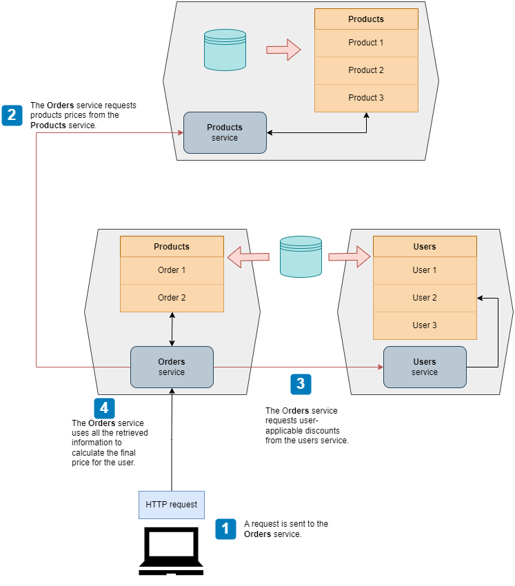

### Loose coupling principle

Microservices should be designed with a clear separation of concerns.

Two implications can be derived from this principle:
+ Each service must be able to work independently from others. If you have a service that can't fulfill a single request without calling another service, they belong together.

+ Each service must be able to be updated without impacting other services. If changes to a service require updates to other services, there is a tight-coupling between and they need to be redesigned.

### Single Responsibility Principle (SRP)

A microservice should be designed around a single business capability or subdomain.

## Service Decomposition Techniques

When dealing with a microservices architecture design, there are two main techniques you can follow to identify what microservices you should be working on:

1. [Decomposition by business capability](#service-decomposition-by-business-capability)
2. Decomposition by subdomain

### Service decomposition by business capability

Decomposition by business capability generally results in an architecture that maps every business team to a microservice.

In this strategy, we look into the activities a business organization performs and how the organization is structured to undertake them, to then creates microservices that mirror that organizational structure.

For example, if an organization has three departments: *Customers*, *Claims*, and *Kitchen*, the service decomposition would be as follows:

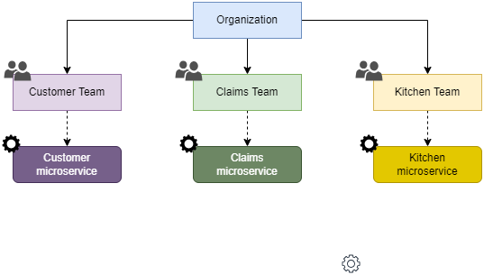

However, most of the scenarios require a little bit more of analysis fieldwork to understand the underlying responsibilities of each department and how they interact together.

#### Analyzing the business structure of an organization

Let's consider a fictitious company called *Mama Jane's Pizza*.

*Mama Jane's Pizza* is a Pizza delivery and carryout restaurant chain that allows you to order Pizza wherever you are and get it delivered to your door, or picked up in the restaurant closer to you.

The organization of the company is as follows:

+ **Products department** &mdash; Customers can order different types of Pizzas and related products out of a catalog managed by the Products department.

+ **Inventory department** &mdash; Availability of products and ingredients at the time of order are managed by the Inventory department.

+ **Finance department** &mdash; This department ensures that the company is profitable and looks after the financial infrastructure required to process customer payments.

+ **Kitchen department** &mdash; Once a user places an order, the Kitchen team is in charge of picking up its details and process it until it is ready to be delivered or picked up.

+ **Delivery department** &mdash; when the order is ready for delivery, a team of riders is in charge of picking it up and take it to the end customer.

#### Associating microservices to business capabilities

With the organization analysis in place, we start doing a 1:1 mapping of each of the relevant business teams to a microservice, identifying also the service's responsibilities.

| SPOILER ALERT: |
| :---- |
| This mapping will not be the final one. |

| Microservice | Aligned Team | Responsibilities |
| :----------- | :----------- | :--------------- |
| Products | Products Team | Owns the product catalog data.<br>The Products team will use this service to maintain the catalog: add new products, update existing ones, etc. |
| Ingredients | Inventory Team | Owns the data about the ingredients stock.<br>The ingredients team is in charge of keeping the ingredients DB in sync with the warehouse stock. |
| Sales | Sales Team | Guides customers through the journey of placing orders and keeps track of them.<br>This service owns the customer data (e.g., orders, registrations, etc.) and the lifecycle of each order.
| Finance | Finance Team | Implements the payment processing activities.<br>Owns the data about user payment details and payment history.<br>The Finance team uses this service to keep the company accounts up to date and to ensure payments work correctly. |
| Kitchen | Kitchen Team | Sends orders to the restaurants' kitchens and keeps track of their progress. It also monitors the performance of the different kitchen systems. |
| Delivery | Delivery Team | Arranges the delivery of the order to the customer once it has been produced by the kitchen. It provides additional services, such as the translation of the user location to coordinates to choose the closest restaurant, and chooses the best route for the rider. It owns the data about each delivery made. |

Right after that, we must evaluate whether each of the microservices satisfy the three principles mentioned at the beginning of the document:

1. Database per service Principle
    + Each microservice must own a specific set of data.
    + No other service should have access to the data owned by the microservice except through an API.

2. Loose coupling Principle
    + Each service must be able to work independently from the others. If a service can't fulfill a single request without calling another service, they belong together.

    + Each service must be able to be updated without impacting other services. Otherwise, there's tight coupling and the services need to be redesigned.

3. Single Responsibility Principle

    + Each service should be designed around a single business capabilitiy or subdomain.

All of the services seem to comply with the *database-per-service principle* as all of them owned a defined set of data with no intersection between them.

However, the *Products* and *Ingredients* services are so tightly coupled. For example, the Products service won't be able to do anything by itself without contacting first the Ingredients service, as it needs to check if the ingredients of the selected product are available, and send a signal to update the stock as soon as the cooking process begins.

As a result, it'll be recommended to have a single Products service that both the Products and Ingredients team own.

### Service decomposition by subdomains

A stronger technique, and one that can be applied to scenarios not aligned to organizations is the *Decomposition by Subdomains* strategy.

This strategy draws inspiration from the field of domain-driven design (DDD) &mdash; an approach to software development that focuses on modeling the processes and flows of the business with software using the same language business users employ.

When applied to a microservice architecture, DDD helps us define the core responsibilities of each service and its boundaries.

#### What is domain-driven design (DDD)?

DDD is an approach to sw development that focuses on modeling the processes and flows of the business users. DDD offers an approach to software development that tries to reflect as accurately as possible the ideas and the language that businesses, or end-users of the software, use to refer to their processes and flows.

To do so, DDD encourages the creation of a rigorous, model-based language that software developers can share with the users. This language is called *ubiquitious language*.

First you need to identify the core domain of a business:

+ *Mama Jane's Pizza* &mdash; delivery of high-quality pizza to customers as quickly as possible regardless of their location.

+ Logistics company &mdash; shipment of products.

Once the core domain is identified, you continue with the discovery of subdomains and generic subdomains:

A subdomain will be an area of the business that is not directly related to value generation, but it is fundamental to support it. For *Mama Jane's* it might be the riders management; for a logistics company, it might customer support for the users shipping their products.

The core domain gives you a definition of the problem space: it will describe what you try to solve with software.

The solution consists of a model (set of abstractions that describe the domain and solves the problem).

In practice, most problems require the collaboration of different models, with their own *ubiquitious languages*. The process of defining such models is called *strategic design*.

#### Applying strategic design to *Mama Jane's Pizza*

To break down a system into subdomains, it helps to think about the operations the system has to perform to accomplish its goal.

In the case under study, we want to model the process of taking an order and delivering it to the customer.

This can be broken down into the following steps:

1. When the customer lands on the website, we show them the product catalog. Each product is marked as available or unavailable. The customer can filter the list by availability and sort it by price (ascending and descending).

1. The customer selects one or more products.

1. The customer pays for their order.

1. Once the customer has paid, we pass on the details of the order to the kitchen.

1. The kitchen picks up the order and produces it.

1. The customer monitors progress on their order.

1. Once the order is ready, we arrange its delivery with a rider.

1. The customer tracks the delivery itinerary until it is deliverd to their door.


Those steps can be pictured in a user journey:

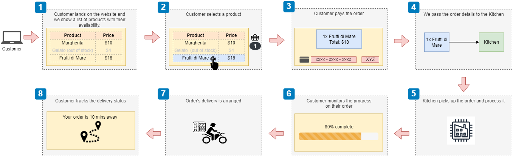

The user journey is a useful artifact for discovering the business subdomains:

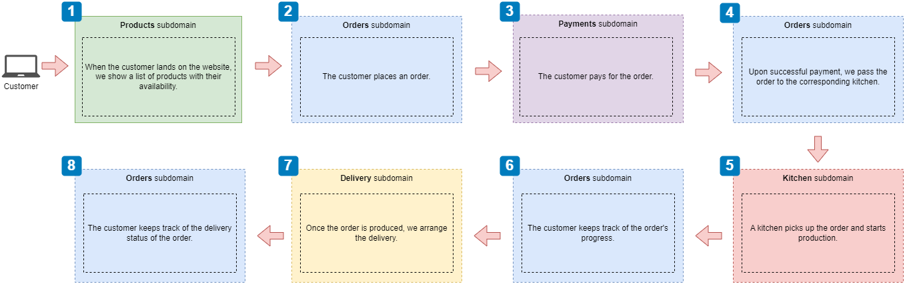

The diagram leads us to the following subdomains:

+ **Products** &mdash; Tells us which products are available and which aren't. To do so, the products subdomain needs to be able to track the amount of each product and ingredient in stock.

+ **Orders** &mdash; Manages the lifecycle of each order. This subdomain owns data about the users' orders, and exposes an interface to manage orders and check their status. This subdomain also needs to take care of passing the order details to the kitchen once the payment is done. It also needs to allow the user to check the status of the order while it is being processed. Finally, it also needs to interact with the delivery system to arrange the delivery and expose the status of the delivery.

+ **Payments** &mdash; Handles user payments. Contains all the logic needed for payment processing (card validation, integration with 3rd party payment systems, ...). This subdomains owns all the data related to user payments.

+ **Kitchen** &mdash; Manages the production of the customer's order. This subdomain owns data related to the production of the customer's order, exposing an interface to enable receiving orders and exposing their status. It also notifies the orders subdomain when the order is ready so that it can be delivered.

+ **Delivery** &mdash; Contains specialized logic to resolve the geolocation of the customer and calculate the optimal route. It manages the fleet of riders. It owns data related to all the deliveries. The orders subdomain interfaces with this subdomain to update the itinerary of the customer's order.

Not how each subdomain can be mapped 1:1 to a microservice, as each subdomain encapsulates a well-define and clearly differentiated area of logic that own some portial of the overall application data.

As a result, when applying strategic analysis to an application as defined in DDD, we guarantee that each subdomain can be represented by a microservice that comply with the three microservices principles: database per service, loose coupling, and single responsibility.

The strategic analysis process can be therefore summarized as follows:

1. Describe in text an operation the user needs to perform, as a sequence of steps (e.g., successful delivery of a customer's order).

1. Create a user-journey diagram, depicting in broad lines what happens in each step.

1. Create a subdomain-discovery diagram, identifying the subdomains that play a role in each step.

1. For each subdomain, elaborate on the following aspects:
    + what is the subdomain's main responsibility (e.g., Handle user payments).
    + what is the data that the subdomain owns.
    + what inbound and outbound interactions will be expected in this subdomain (i.e., this will be an indication of the service's interface).

1. Map each subdomain to a microservice.

#### 'Decomposition by business capability' vs. 'decomposition by subdomain'

Both approaches give us different perspectives on the business problem. While *decomposition by subdomain* strategy is more generally applicable, when using *decomposition by business capability* you will end up with an architecture that resembles the existing organizational structure, which might facilitate the collaboration between the business and the technical teams.

The downside of the *decomposition by business capability* is that in general the organizational structure of a company is not necessarily the most efficient from the software development perspective, and in many companies that structure changes frequently. Also, not all the software problems are aligned to a company problem (especially for small-medium software apps).

In summary, if you must choose a single approach, use *decomposition by subdomain*. If you have sufficient time to do a thorough analysis, combine both strategies.

## Service and Data Layer Patterns

A web microservice should be structured around three layers:


We've already dealt with the API layer, which exposes the application capabilities as endpoints the application consumers can invoke.

In this section, you will deal with the business (sometimes called application logic) layer the implements the capabilites of the service. In  our Pizza restaurant ordering example, this means taking orders, processing payments, or scheduling orders for production.

You will also tackle the data layer, which implements the data management capabilities. In our Pizza restaurant ordering service, we will need to own and manage all the data about orders, implement a persistent storage solution, and expose an interface to use it.

During the process you will learn:

+ Patterns to fetch data from other services and handle the integrations with other microservices that expose the capabilities we need.
+ The architectural layout required to keep our microservices loosely coupled, so that we can change a component's implementation without affecting the ones that rely on the one that's been changed.

### Introducing the hexagonal architecture for microservices

The concept of hexagonal architecture, also called the architecture of ports and adapters, was introduced in 2005 by [Alistair Cockburn](https://en.wikipedia.org/wiki/Alistair_Cockburn) as a way to help structure apps as a set of loosely coupled components.


In this architecture, we distinguish the core layer of our application (the business layer), which is in charge of the service's capabilities, from other components such as the Web API interface or the database interface.

In this architecture we attach *adapters* to the core (business) layer, to help it communicate with external components.

This simple idea helps you build loosely coupled services: you keep the core logic of the service and the logic for the adapters strictly separated:
+ The logic that implements the web API layer shouldn't interfere with the implementation of the core business logic.
+ The database, regardless of the technology uses, shouldn't interfere with the core business logic.

This separation is achieved through ports. Ports are technology agnostic interfaces that connect the business layer with the adapters.

A great way to establish the relationship between the core business logic and the adapters is the **Dependency Inversion Principle** which states:

+ High-level modules shouldn't depend on low-level details. Instead, both should depend on abstractions (e.g., interfaces).

        For example, when the core layer requires saving data, it shouldn't care whether the database is SQL or NoSQL.

+ Abstractions shouldn't depend on details. Instead, details should depend on abstractions.

        For example, the data layer must depend on the interface, and not the other way around. When designing the interface between the business layer and the data layer, we want to make sure that the interface doesn't change based on the implementation details of the database.

The following diagram illustrates this idea:

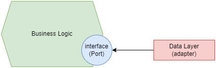

The adapters will depend on the interface exposed by the core business layer. The Data Layer will be implemented against that interface.

| NOTE: |
| :---- |
| While related, the **Inversion of Control Principle** is different from the **Dependency Inversion Principle**. The former tells you to supply code dependencies through the execution context, while the latter promotes a loosely coupled design. |

The Dependency Inversion Principle should be applied to the API interface too, so that the final high-level picture for the hexagonal architecture will look like the following:

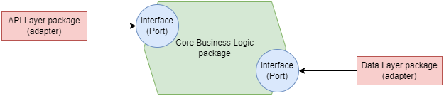

### Defining the project structure

To reinforce the separation of concerns between the core business layer and the API and database adapters it is recommended to group each of them in different directories.

In our Pizza restaurant example, the Order service will look like the following:

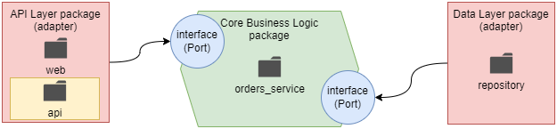

+ Business layer &mdash; implemented under `orders/orders_service`.

+ API layer &mdash; implemented under `orders/web`. If implementing a single type of web adapter (REST API in this case), you can create an additional directory `orders/web/api` to host the REST API adapter for the service. Additional directories could be created for additional web adapters, such as server-side rendered frontends, etc.

+ Data layer &mdash; implemented under `orders/repository`. Note that in this case, the name reflects the design pattern used to interface with the data.

### Implementing the database models

In this step you deal with the definition of the database models for your service. This means thinking about the database tables and their fields.

Depending on the complexity of the project, you might want to jump right away to an Object Relational Mapper (ORM) such as [SQLAlchemy](https://github.com/sqlalchemy/sqlalchemy), or define the tables and their relaionships yourself. You might also rely on a NoSQL database.

Either way, you will need to think about the Python classes that map to the records in your database, so that you can represent the values in each record of the database as an object. Creating those classes will also let you enhance the data those classes represent with custom methods.

Additionally, you need to start thinking about migrations: how to embrace and keep track of changes in your database and database models. In some cases, you will be able to rely on existing tools such as [SQLAlchemy: Alembic](https://github.com/sqlalchemy/alembic), otherwise you might need to handle migrations yourself.

When dealing with this task, you should start with the core object of your service, understand what operations it will need to support.

For example, in our Pizza restaurant Order service, the order object will be the main thing we need to model. Users will place, pay, update, and cancel orders. The order will also have a lifecycle associated to it which will be tracked via its status.

A good way to start is with a textual representation of the model:

| Model Property | Description |
| :------------- | :---------- |
| **ID** | Unique ID for the order. A UUID will be appropriate for this field (instead of incremental integers). |
| **Creation Date** | Records when the order was places. |
| **Items** | The list of items included in the order, and the amount of each product. Since an order can have any number of items, a different model will be used for the items in an order, and a one-to-many relationship between the order and the items will be established. |
| **Status** | Keeps track of the status of the order:<ul><li>Created: the order has been placed.</li><li>Paid: the order has been paid.</li><li>Progress: the order is being worked on (in the kitchen).</li><li>Cancelled: the order has been cancelled.</li><li>Dispatched: the order has been sent to the user.</li><li>Delivered: the order has been delivered to the user.</li></ul> |
| **Schedule ID** | The ID of the order in the Kitchen service.<br>This ID will be created in a separate microservice after having scheduled the order for production, and we'll use it to keep track of its progress in the kitchen. |
| **Delivery ID** | The ID of the order in the Delivery service.<br>This ID will be created in a separate microservice after having scheduled it for dispatch. You'll use it to keep track of its progress during delivery. |

The Order service will also require modeling the item, which will keep track about the product(s) selected by the user for a particular order. As each order will have one or many items, there will be a one-to-many relationship between an order and item models.

| Model Property | Description |
| :------------- | :---------- |
| **ID** | A unique identifier for the item, using UUID format. |
| **Order ID** | A foreign key representing the ID of the order the item belongs to. |
| **Product** | The string representation of the product selected by the user. |
| **Size** | The size of the product. |
| **Quantity** | The amount of product the user wishes to buy. |

In our project structure, those models will be placed in `orders/repository/models.py` and defined as the Python classes `OrderModel` and `OrderItemModel`. Depending on the approach, those classes will be coded as regular classes or SQLAlchemy classes.

### Applying the Repository Pattern for data access

The **Repository Pattern** is a design pattern that helps you decouple the business layer from the implementation details of the database.

While simpler applications can rely on the **Active Record Pattern**, in which the database models are used in the business logic directly, it only works well when you have a one-to-one mapping between the service capabilities and the database operations and you don't need the collaboration of multiple domains. Effectively, when using this pattern, a change on the underlying storage technology (e.g., SQL to NoSQL db) will have an impact on the business layer.

By contrast, the **Repository Pattern** exposes a consistent interface to the business layer to interact with the database technology you use to store your data, no matter which one that is.

The following diagram illustrate how this works:

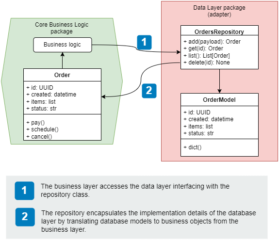

#### Implementing the Repository Pattern

**REVIEW FROM HERE ONCE IMPLEMENTATION IS COMPLETE**

There are different strategies to implement the **Repository Pattern**.

The one you'll follow is: none of the operations carried out by the repository can be committed by the repository into the database.

This means that if you add an order object to the repository, the repository will add the object, but won't commit it to the database. Instead, it will be the responsibility of the repository's consumer (the service) to commit the changes.

This is because the repository is not the right place to manage transactions. The outer layers are the ones that have all the context to decide when a transaction is complete.

As a direct consequence of this strategy, the repository simply acts as an *in-memory* list to which objects are added, removed, and updated.

This strategy ensures that even complex processes involving invoking multiple processes will work well.

For example, this is how the processing of a payment will look in our Pizza Delivery application:

1. The API layer receives the request from the user and invokes a `pay_order()` method on the `OrdersService` to process the request.

1. `OrdersService` talks to the payments service to process the payment.

1. If the payment is successful, `OrdersService` schedules the production of the order by invoking an endpoint on the `KitchenService`.

1. `OrdersService` updates the state of the order in the database using the `OrdersRepository`.

1. If all the previous operations are successful, the API layer commits the transaction to the database, otherwise, it rolls back all the changes.

Another implementation detail of this strategy (as depicted on the previous diagram).

The skeleton of the `OrdersRepository` pattern will be something like:

```python
class OrdersRepository:
    def __init__(self, session):
        """session represents the database session to which objects will be added"""
        ...

    def add(self, items) -> Order:
        """items are plain dicts sent from the service layer to create the data layer models"""
        ...

    def get(self, id_) -> Order:
        ...

    def list(self, limit=None, **filters) -> list[Order]:
        ...

    def update(self, id_, **payload) -> Order:
        """payload is a plain dict of the order to update"""
        ...

    def delete(self, id_) -> None:
        ...
```

Note that the repository does not receive instances of data layer models, and do not return model instances either. Instead, it returns `Order` *business objects* defined in the service layer.

### Implementing the business layer

The business logic represents the core of the hexagonal architecture.


Based on the previous analysis we should have a clear view of the capabilities this layer is responsible for.

For example, in our Pizza Restaurant Delivery app, we know the the Orders service will allow users of the platform to place their orders and manage them:

+ Place order &mdash; create a record representing an order in the system. This order won't be scheduled for production in the kitchen until the user pays for it.

+ Process payment &mdash; process the payment of an order with the help of the payment service. If the payment is successful, the Orders service will schedule the order for production by interfacing with the Kitchen service.

+ Update order &mdash; allow the user to update their order to add or remove items from it. To confirm a change, a new payment must be processed with the help of the payments service.

+ Cancel orders &mdash; allow the user to cancel their order anytime. Depending on the status of the order, the Orders service will interact with either the Kitchen or the Delivery Service.

+ Keep track of the order's progress &mdash; allow the user to keep track of their order's status through the Orders service. Depending on the status of the order, the orders service checks with the Kitchen or the Delivery service to get updated information about the state of the order.

The application architecture of the business logic is represented as follows:

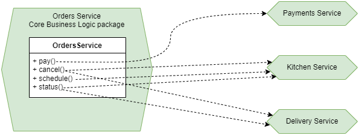

We have to be conscious that we don't want to get the service layer in which the business logic is implemented tightly coupled to the `OrdersRepository`.

This means that we shouldn't be doing this:

```python
# Don't do this!!!

class OrdersService:
    def __init__(self):
        self.repository = OrdersRepository()
```

This not only creates a tight coupling between the service and the access layer, but also places too much responsibility on the `OrdersService` as it will need to know how to correctly configure the repository.

Instead, we should be using **Dependency Injection** in combination with the **Inversion of Control (IOC) principle**.

That is, by applying **IoC** we supply the dependencies a component needs using **Dependency Injection** &mdash; the context will be responsible for providing correctly configured instances of the dependencies.

This picture illustrates what we intend to do:

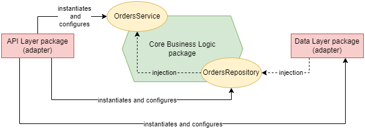

The first thing we need to identify is the *context* in which dependencies are instantiated and provided to the component.

For the Orders service, a suitable IoC container will be the request object, since most operations will be enclosed by the request.

This means that the correct instantiation of the `OrdersService` will look like:

```python
# Using DI to enforce loose coupling

class OrdersService:
    def __init__(self, orders_repository):
        self.orders_repository = orders_repository
```

Note the benefits of this approach:
+ the responsibilities of the service are simplified, as it doesn't need to know how to instantiate a repository.
+ the service is more flexible as it can use different repository implementations provided that they all conform to the same interface.

In our example, the API layer will be responsible for getting a valid instance of the `OrderRepository` and pass it in the `orders_repository` parameter.

Now we can start implementing the service:

```python
class OrdersService:

    def __init__(self, orders_repository):
        self.orders_repository = orders_repository

    def place_order(self, items):
        ...

    def get_order(self, order_id):
        ...

    def update_order(self, order_id, items):
        ...

    def list_orders(self, **filters):
        ...

    def pay_order(self, order_id):
        ...

    def cancel_order(self, order_id):
        ...
```

The business layer will also define classes representing the **domain objects**. These objects will keep track of the order information in the business layer and will be returned by the repository.

In our example, we will have an `Order` class representing the orders before and after saving them to the database.

Note that because some of the properties of the `Order` will be known only after changes have been committed to the database, we need to mark some properties as private and implement them as properties to add some fronting logic that knows where to pull the values from.

We will also need an `OrderItem` class that represents each of the items in an order.

```python
class OrderItem:
    def __init__(self, id, product, quantity, size):
        self.id = id
        self.product = product
        self.quantity = quantity
        self.size = size

    def dict(self):
        return {
            "product": self.product,
            "size": self.size,
            "quantity": self.quantity,
        }


class Order:
    def __init__(
        self,
        id,
        created,
        items,
        status,
        schedule_id=None,
        delivery_id=None,
        order_=None,
    ):
        self._order = order_
        self._id = id
        self._created = created
        self.items = [OrderItem(**item) for item in items]
        self._status = status
        self.schedule_id = schedule_id
        self.delivery_id = delivery_id

    @property
    def id(self):
        return self._id or self._order.id

    @property
    def created(self):
        return self._created or self._order.created

    @property
    def status(self):
        return self._status or self._order.status

    def dict(self):
        return {
            "id": self.id,
            "order": [item.dict() for item in self.items],
            "status": self.status,
            "created": self.created,
        }
```

It is also recommended to create certain custom exceptions (e.g., `APIIntegrationError` when contacting the Kitchen or Payment service, `InvalidActionError` when the user tries to cancel an order that has already been delivered, `OrderNotFoundError` when an order cannot be found in the system, etc.).

These exceptions are typically raised from the core business logic and can be placed in the service package on an `exceptions.py` file:

```python
class OrderNotFoundError(Exception):
    pass

class APIIntegrationError(Exception):
    pass

class InvalidActionError(Exception):
    pass
```

When integrating with other APIs such as the Kitchen or the Payment service, we can use the [`requests`](https://github.com/psf/requests) module.

In every API call, you need to prepare your API request and payload, submit the request, and then check that the response contains the expected status code. If it doesn't, you must raise an exception `APIIntegrationError`.

The following snippet illustrates this idea:

```python
import requests

def pay(self):
    response = requests.post(
        "http://localhost:3001/payments",
        json={"order_id": self.id},
        timeout=10
    )
    if response.status_code == 201:
        return
    else:
        msg = f"Could not process payment for order {self.id}"
        raise APIIntegrationError(msg)
```

It is also worth mentioning that in the early stages of development or when you want to focus on a particular service, you can rely on tools sucn as [Prism CLI](https://www.npmjs.com/package/@stoplight/prism-cli) which enables you to spin up a mock server given an OpenAPI spec:

```bash
npx @stoplight/prism-cli mock payments.yaml --port 3001
```


### Implementing the unit of work pattern

One of the activities we need to deal with when applying the hexagonal architecture is to enrich our API layer to provide it with additional capabilities it didn't have.

In particular, for our Pizza Delivery example, the API layer of the microservice will be the consumer of the `OrdersService` and must ensure:
+ that a well-configured instance of the repository `OrdersRepository` is injected when instantiating the service. In turn, this will mean that a db session must be initialized before any actions are performed.
+ that the API layer either commits or rolls-back the changes when a particular process (such as an order payment) is completed. This will be done via the db session object.

The following diagram illustrates the interactions between the different components, assuming that we rely on SQLAlchemy framework for the repository implementation:

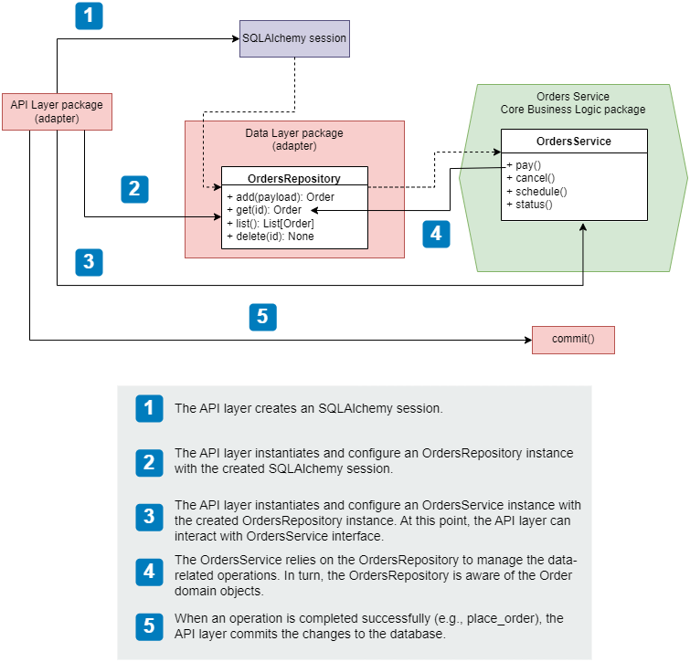

The **Unit of Work** design pattern facilitates this interaction, ensuring that all individual operations are committed as one, or rolled back if any of the individual activities fail

That is, by using this pattern we ensure that a transaction composed by several individual operations is *ACID*:
+ **A**tomic &mdash; the whole transaction either succeeds or fails.

+ **C**consistent &mdash; conforms to the constraints of the database.

+ **I**solated &mdash; doesn't interfere with other transactions.

+ **D**urable &mdash; it's written to persistent storage.

Python context manager is the perfect solution to implement the unit of work, as it will let us lock a resource during an operation, ensuring that any necessary cleanup will be undertaken if anything goes wrong, and that the lock will be released once the operation is successfully completed.

Additionally, the developer experience *DX* of such solution is great:

```python
with UnitOfWork() as unit_of_work:
    # ... individual operation 1
    # ... individual operation 2
    # ... individual operation n
    unit_of_work.commit()
```

And the implementation is not complicated either:

+ `__enter__()` &mdash; defines the operations that must be carried out upon entering the context.

    In our case, the session will be created. If we need the consumer to to perform some actions on any of the objects created in the `__enter__()` method, we can rely on the consumer accessing them via the `as object` clause.

+ `__exit__()` &mdash; defines the operations that must be carried out upon exiting the context.

    In our case, we will use this method to close the session. Additionally, this method captures any exceptions raised during the execution of the context through three parameters received in the `__exit__()` method signature:

    + `exc_type` &mdash; captures the type of the exception raised.

    + `exc_value` &mdash; captures the value bound to the exception, typically the error message.

    + `traceback` &mdash; Traceback object that can be used to identify where the exception took place.

| NOTE: |
| :---- |
| The **Unit of Work** object belongs to the data layer, although it is consumed from the API layer. |

Thus, the skeleton for the implementation of the *Unit of Work** will be the following:

```python


class UnitOfWork:
    """Unit of Work design pattern using a SQLAlchemy session."""

    def __init__(self) -> None:
        """Initialize the unit of work."""
        ...

    def __enter__(self) -> "UnitOfWork":
        """Carry out initialization actions on the unit of work."""
        ...

    def __exit__(
        self,
        exc_type: type[BaseException] | None,
        exc_val: BaseException | None,
        traceback: TracebackType | None,
    ) -> None:
        """Carry out clean up actions upon exiting the unit of work."""
        ...

    def commit(self) -> None:
        """Commit all the in-flight changes to the database."""
        ...

    def rollback(self) -> None:
        """Rollback any in-flight changes."""
        ...
```

And with this elements in place, we can wrap up the integration of the API and service layer.

For example, in our Pizza delivery example, it might look something like:

```python
@app.put("/orders/{order_id}")
def replace_order(order_id: UUID, order_details: CreateOrderSchema) -> GetOrderSchema:
    try:
        with UnitOfWork() as unit_of_work:
            repo = OrdersRepository(unit_of_work.session)
            orders_service = OrdersService(repo)
            order = order_details.dict()["order"]
            for item in order:
                item["size"] = item["size"].value
            order = orders_service.update_order(order_id=order_id, items=order)
            unit_of_work.commit()
        return order.dict()
    except OrderNotFoundErr as e:
        raise HTTPException(status_code="404", detail=f"Order with id {order_id} was not found") from e
```